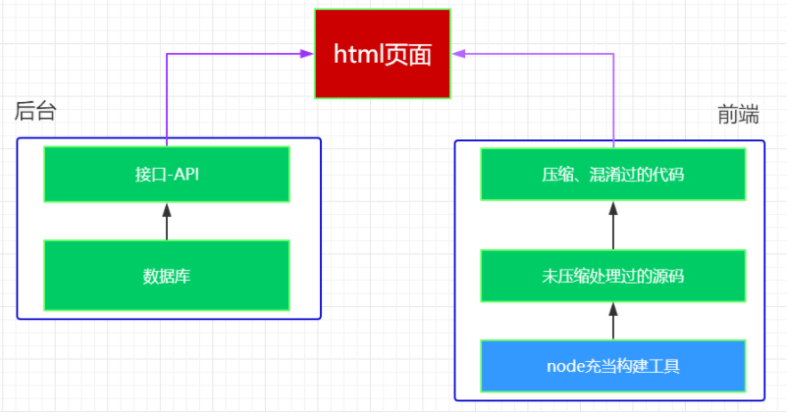

# 项目介绍

## 项目背景

品优购网上商城是一个综合性的 B2B2C 平台，类似京东商城、天猫商城。网站采用商家入驻的模式，商家入驻平台提交申请，有平台进行资质审核，审核通过后，商家拥有独立的管理后台录入商品信息。商品经过平台审核后即可发布。

品优购网上商城主要分为网站前台、运营商后台、商家管理后台三个子系统

### 网站前台


## 架构介绍

目前企业中开发的项目，大部分是使用 **前后端分离** 的架构。如图 



# 技术在线

可能需要用得到的网站

| 名称         | 网址                                                     | 备注               |
| ------------ | -------------------------------------------------------- | ------------------ |
| zepto        | http://www.css88.com/doc/zeptojs_api/                    | zepto的中文api     |
| art-template | https://aui.github.io/art-template/zh-cn/docs/index.html | 模版引擎           |
| fontawesome  | http://www.fontawesome.com.cn/                           | 字体图标           |
| iscroll      | https://www.kancloud.cn/kancloud/iscroll-api/77883       | 滚动条组件         |
| mui官网      | http://dev.dcloud.net.cn/mui/                            | 官方网站           |
| hello-mui    | http://www.dcloud.io/hellomui/                           | 在线案例           |
| mui-辅助类   | http://www.mubrand.com/?post=19                          | mui的辅助类        |
| 品优购在线   | http://pyg.ak48.xyz/                                     | 上课参照的案例     |
| 上课源代码   | https://gitee.com/ukSir/mobile_pyg.git                   | 上课的源代码的地址 |
| api接口文档  | [api.md](接口文档/api.md)                                |                    |


# 关键代码

## mui轮播图

轮播图如果是动态生成,则需要在渲染完毕之后,手动执行初始化.

### HTML

```html
<div class="mui-slider">
  <div class="mui-slider-group mui-slider-loop">
    <!--支持循环，需要重复图片节点-->
    <div class="mui-slider-item mui-slider-item-duplicate"><a href="#"></a></div>
    <div class="mui-slider-item"><a href="#"></a></div>
    <div class="mui-slider-item"><a href="#"></a></div>
    <div class="mui-slider-item"><a href="#"></a></div>
    <div class="mui-slider-item"><a href="#"></a></div>
    <!--支持循环，需要重复图片节点-->
    <div class="mui-slider-item mui-slider-item-duplicate"><a href="#"></a></div>
  </div>
</div>
```

### javascript

```javascript
//获得slider插件对象
var gallery = mui('.mui-slider');
gallery.slider({
  interval:5000//自动轮播周期，若为0则不自动播放，默认为0；
});
```

## 正在等待效果

> 基于font-awesome的正在等待效果

```css
.loadding {
  &::before {
    position: fixed;
    top: 0;
    left: 0;
    width: 100%;
    height: 100%;
    background-color: #fff;
    opacity: .5;
    content: "";
    z-index: 100;
  }
  &::after {
    font: normal normal normal 14px/1 FontAwesome;
    position: fixed;
    top: 40%;
    left: 50%;
    margin-left: -50px;
    font-size: 100px;
    color: #0094ff;
    content: "\f013";
    z-index: 101;
    animation: fa-spin 1s infinite linear;
  }
}
```


## mui上拉刷新下拉加载

### HTML

```html
//  lt_view 为下拉-上拉的容器  里面必须加一层嵌套 div   
<div class="lt_view">
    //2 div 为额外添加的嵌套
    <div>
      //3 .lt_content 为存放数据的容器
        <ul class="lt_content">
        数据
        </ul>
    </div>
  </div>
```

### css

```css
/* 给最外层容器加上 相对定位 */
.lt_view{
  position: relative;
}
```

### 初始化javascript

```javascript
  mui.init({
  pullRefresh: {
    container: ".lt_view",
    down: {
      auto: true,
      //  触发下拉刷新时自动触发
      callback: function () {
      }
    },
    up:{
      //  触发上拉刷新时自动触发
      callback:function () {
      }
    }
  }
});
  
```

### api

```javascript
// 结束下拉刷新
mui('.lt_view').pullRefresh().endPulldownToRefresh();

// 结束上拉加载更多 如果没有数据 传入 true 否则 传入 false
mui('.lt_view').pullRefresh().endPullupToRefresh();

// 重置 组件
mui('.lt_view').pullRefresh().refresh(true);
```

## zepto

### 设置拦截器

 `beforeSend`会在发送请求之前被调用

```javascript
  $.ajaxSettings.beforeSend = function (xhr, obj) {
    obj.url = baseUrl  + obj.url;
  }
```

`complete` 会在请求结束后被调用

```javascript
  $.ajaxSettings.complete = function () {
	
  }
```

### 扩展zepto

 为 **$** 对象增加自定义方法 如 可以这样使用 `$.show();`

```javascript
  $.extend($, {
    show: function () {
      $("body").addClass("waitting");
    }
  });
```

## art-template

设置变量,让 自定义变量在模板中可以使用

### javascript

```javascript
  template.defaults.imports.iconUrl = "www.baidu.com";
```

### HTML

在模板中调用

```html
<div>{{iconUrl}}</div>
```

# 常用工具函数

## 设置rem

```javascript
  function setHTML() {
    // 基础值
    var baseVal = 100;
    // 设计稿的宽度
    var pageWidth = 375;
    // 要适配的屏幕的宽度?
    var screenWidth = document.querySelector("html").offsetWidth;
    // 要设置的fontsize
    var fontsize = screenWidth * baseVal / pageWidth;
    // 设置到html标签的中
    document.querySelector("html").style.fontSize = fontsize + "px";
  }
```

## 获取url中的参数

```javascript
    getUrl: function (name) {
      var reg = new RegExp("(^|&)" + name + "=([^&]*)(&|$)", "i");
      var r = window.location.search.substr(1).match(reg);
      if (r != null) return decodeURI(r[2]);
      return null;
    },
```

## 验证手机号码

```javascript
function checkPhone(phone) {
    if (!(/^1[34578]\d{9}$/.test(phone))) {
        return false;
    } else {
        return true;
    }
}
```

## 验证码邮箱

```javascript
function checkEmail(myemail) {　　
    var myReg = /^[a-zA-Z0-9_-]+@([a-zA-Z0-9]+\.)+(com|cn|net|org)$/;
    if (myReg.test(myemail)) {　　　　
        return true;　　
    } else {　　　　
        return false;
    }
}
```
